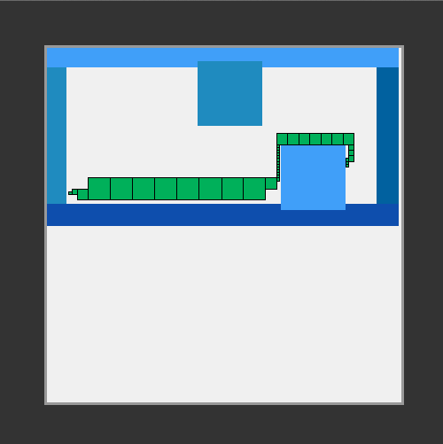

AStar with QuadTree
===================

##FR
Ce projet est un exemple d'utilisation de l'algorithme de recherche de chemin A star dans un plan sous forme de QuadTree. Ce code en Python a été réalisé à partir de l'article de Mathieu Turcotte [Quadtree et path planning avec l'algorithme A*](http://mathieuturcotte.ca/textes/quadtree/)[FR]. Pour de plus amples renseignements, je vous invites à consulter son article.

Il est possible de tester l'algorithme en lançant le fichier [principale.py](principale.py) qui contient un main. Le fichier [dessin_quadtree.py](dessin_quadtree.py) sert à afficher dans une fenêtre un exemple de recherche de chemin. Le résultat est donner dans l'image plus bas.

Remarque : l'heuristique de ce projet a été personnalisée pour privilégier les longues lignes droites.

##EN
This project is an example of A star, a pathfinding algorithm with a QuadTree map. The Python code was made from Mathieu Turcotte's article [Quadtree et path planning avec l'algorithme A*](http://mathieuturcotte.ca/textes/quadtree/)[FR]. For more information, I invite you to read his article.

It is possible to test the algorithm running using [principale.py](principale.py). [dessin_quadtree.py](dessin_quadtree.py) is used to show in a window an example of pathfinding. The result is in the below image.

Note : the heuristic was customised to favor long straights.

##Exemple/Example
